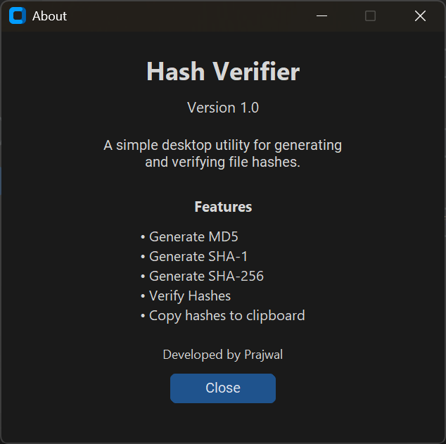

# Hash Verifier

A lightweight desktop tool for generating and verifying file hashes from a file and verifying the hashes with a clean and modern interface

Supports:

- MD5
- SHA-1
- SHA-256


## Features

- Generate MD5
- Generate SHA-1
- Generate SHA-256
- Verify Hashes
- Copy hashes to clipboard

## Screenshots

### Main Window


### Verification


### About window



## Installation

### Option 1: Download the executable (Recommended)

1. Download `HashVerifier.exe` from the latest release.
2. Open `HashVerifier.exe`.
3. If Windows blocks the application then:
   - Open Windows Security.
   - Navigate to App & browser control.
   - Select Smart App Control.
   - Turn Smart App Control Off.
   - Launch `HashVerifier.exe` again.

> **Note:** Smart App Control is a windows security feature that blocks applications without an established reputation. Only disable it if you trust the executable.

> No Python Installation is required.

### Option 2 - Run from Source

#### Clone the repository

```bash
git clone https://github.com/Prajwal-747/Hash-Verifier
cd Hash-Verifier
```

#### Create a virtual environment

```bash
python -m venv .venv
```

#### Activate it

Windows CMD:

```cmd
.venv\Scripts\activate
```

Powershell:

```powershell
.venv\Scripts\Activate.ps1
```

Git Bash:

```bash
source .venv/Scripts/activate
```

---

### Install Dependencies

```bash
pip install -r requirements.txt
```

### Run the application

```bash
python src/main.py
```

## Building the Executable

```bash
pyinstaller --onefile --windowed --name "HashVerifier" src/main.py
```

The executable will be located in

```
dist/
└── HashVerifier.exe
```

## Tech Stack

- Python 3.12
- CustomTkinter
- hashlib
- tkinter
- pyperclip
- PyInstaller

## Author

**Prajwal**

If you found this project useful, consider giving it a ⭐ on GitHub.

## License

This project is licensed under the MIT License
